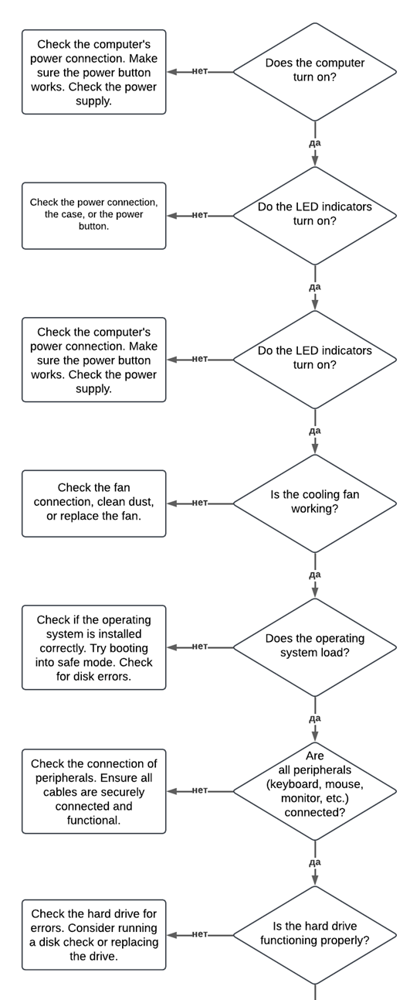
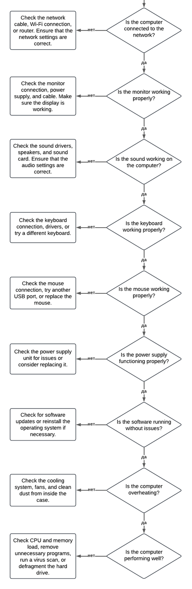

# Лабораторная работа: Разработка экспертной системы на CLIPS

## Введение

В данной лабораторной работе разработана экспертная система для диагностики неисправностей компьютера. Основной задачей являлось создание системы, способной задавать пользователю вопросы, анализировать ответы и предоставлять рекомендации по устранению неисправностей.

Цель лабораторной работы — освоение методов представления знаний в продукционной форме, а также практическое применение среды разработки экспертных систем **CLIPS**.

---

## Описание предметной области и постановка задачи

**Предметная область:** Диагностика неисправностей персонального компьютера, включая проблемы с питанием, аппаратной частью, периферией и программным обеспечением.

**Постановка задачи:**
1. Разработать базу знаний с использованием продукционных правил для диагностики неисправностей.
2. Реализовать интерактивный диалог с пользователем для получения информации о проблемах.
3. Предоставить рекомендации по устранению выявленных неисправностей.

---

## Дерево решений экспертной системы

Дерево решений представлено на рисунке ниже (вставьте изображение или опишите логику):

*Примечание:* В системе реализована последовательная проверка ключевых узлов:

1. Включение компьютера
2. Светодиодные индикаторы
3. Работа кулера
4. Загрузка ОС
5. Подключение периферии
6. Состояние жёсткого диска
7. Сетевое подключение
8. Работа монитора
9. Работа звука
10. Работа клавиатуры
11. Работа мыши
12. Работа блока питания
13. Программные сбои
14. Перегрев
15. Производительность

При отрицательном ответе на любом этапе выдаётся соответствующая рекомендация.